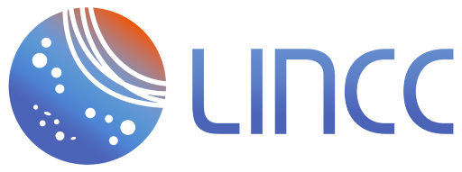

# Scipy 2025 Tutorial: Large Astronomical Survey Analysis with LSDB & Nested

[](https://lincc-ppt.readthedocs.io/en/latest/)




This repository contains all materials for the LSDB tutorial[TODO: LINK] prepared for the [Scipy 2025 Conference](https://www.scipy2025.scipy.org/) in Tacoma, WA.

### Main references

* Slide Decks [Links to Come]
* LSDB ([on GitHub](https://github.com/astronomy-commons/lsdb)) 
  ([on ReadTheDocs](https://lsdb.readthedocs.io/en/stable/))
* HATS ([on GitHub](https://github.com/astronomy-commons/hats))
  ([on ReadTheDocs](https://hats.readthedocs.io/en/stable/))
* nested-dask ([on GitHub](https://github.com/lincc-frameworks/nested-dask)) 
  ([on ReadTheDocs](https://nested-dask.readthedocs.io/en/stable/))
* nested-pandas ([on GitHub](https://github.com/lincc-frameworks/nested-pandas)) 
  ([on ReadTheDocs](https://nested-pandas.readthedocs.io/en/stable/))


## Abstract
The exponential growth of large survey catalogs has introduced new challenges for astronomical datasets. Our session showcases the LSDB framework, an analysis framework built upon hierarchically sharded spatial partitioned data with Parquet for efficient cross-matching and analysis. We’ll showcase nested-pandas/nested-dask for time-domain and spectral data, and highlight real-world applications across wide-sky datasets, with the nod toward the upcoming Rubin Survey.

## Installation

```
>> conda create --name lincc python=3.12
>> conda activate lincc
>> pip install lsdb
```

## Notebooks
Todo

## LINCC Tech Talks

Watch the following [LINCC Tech Talk](https://www.youtube.com/watch?v=yoGhI72Vl40) to learn more about LSDB. Other relevant talks can be found in the [LSST Discovery Alliance website](https://lsstdiscoveryalliance.org/programs/tech-talks/).

## Acknowledgements

This project is supported by Schmidt Sciences.

This project is based upon work supported by the National Science Foundation under Grant No. AST-2003196.

This project acknowledges support from the DIRAC Institute in the Department of Astronomy at the University of Washington. The DIRAC Institute is supported through generous gifts from the Charles and Lisa Simonyi Fund for Arts and Sciences, and the Washington Research Foundation.


