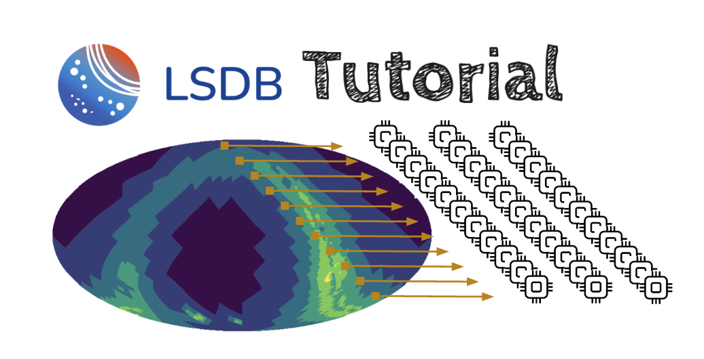

# Scipy 2025 Tutorial: Large Astronomical Survey Analysis with LSDB & Nested

[](https://lincc-ppt.readthedocs.io/en/latest/)

<p align="center">
   
</p>

[comment]: 


This repository contains all materials for the LSDB tutorial[TODO: LINK] prepared for the [Scipy 2025 Conference](https://www.scipy2025.scipy.org/) in Tacoma, WA.

### Main references

* Slide Decks [Links to Come]
* LSDB ([on GitHub](https://github.com/astronomy-commons/lsdb)) 
  ([on ReadTheDocs](https://lsdb.readthedocs.io/en/stable/))
* HATS ([on GitHub](https://github.com/astronomy-commons/hats))
  ([on ReadTheDocs](https://hats.readthedocs.io/en/stable/))
* nested-dask ([on GitHub](https://github.com/lincc-frameworks/nested-dask)) 
  ([on ReadTheDocs](https://nested-dask.readthedocs.io/en/stable/))
* nested-pandas ([on GitHub](https://github.com/lincc-frameworks/nested-pandas)) 
  ([on ReadTheDocs](https://nested-pandas.readthedocs.io/en/stable/))


## Abstract
The exponential growth of large survey catalogs has introduced new challenges for astronomical datasets. Our session showcases the LSDB framework, an analysis framework built upon hierarchically sharded spatial partitioned data with Parquet for efficient cross-matching and analysis. We’ll showcase nested-pandas/nested-dask for time-domain and spectral data, and highlight real-world applications across wide-sky datasets, with the nod toward the upcoming Rubin Survey.

## Installation

```
>> conda create --name lincc python=3.12
>> conda activate lincc
>> pip install lsdb
```

## Hands-On Notebooks

### Notebook 1: [Basic LSDB Queries](https://github.com/lincc-frameworks/scipy-2025-lsdb-nested/blob/main/docs/notebooks/basic_lsdb_queries.ipynb)

This notebook steps through the basics of the LSDB interface. We query large catalogs for a small chunk of data, and perform some basic filtering and cross-matching between multiple surveys. 


### Notebook 2: [Large Scale LSDB Analysis](https://github.com/lincc-frameworks/scipy-2025-lsdb-nested/blob/main/docs/notebooks/large_scale_lsdb.ipynb)

In this notebook, we ramp up the scale to analyze a considerably larger section of the sky. We show how to utilize Dask in large scale analysis, showing the available tooling and providing some tips & tricks for optimizing computationally intensive workflows.

### Notebook 3: [Nested-Pandas Introduction](https://github.com/lincc-frameworks/scipy-2025-lsdb-nested/blob/main/docs/notebooks/nested_intro.ipynb)

This notebook explores the Nested-Pandas API, showing the basics of nesting data and touring the various ways of working with nested data.

### Notebook 4: [Time-Domain Analysis](https://github.com/lincc-frameworks/scipy-2025-lsdb-nested/blob/main/docs/notebooks/time_domain.ipynb)

This notebook showcases the usage of LSDB and Nested to do large scale time-domain analysis. We build a dataset from multiple input surveys, and select a subset of interesting objects from large sections of the sky. We compute periodograms (or any other function of interest to the user!) on our objects of interest and conclude with working with their spectra.


## LINCC Tech Talks

Watch the following [LINCC Tech Talk](https://www.youtube.com/watch?v=yoGhI72Vl40) to learn more about LSDB. Other relevant talks can be found in the [LSST Discovery Alliance website](https://lsstdiscoveryalliance.org/programs/tech-talks/).

## Acknowledgements

This project is supported by Schmidt Sciences.

This project is based upon work supported by the National Science Foundation under Grant No. AST-2003196.

This project acknowledges support from the DIRAC Institute in the Department of Astronomy at the University of Washington. The DIRAC Institute is supported through generous gifts from the Charles and Lisa Simonyi Fund for Arts and Sciences, and the Washington Research Foundation.


